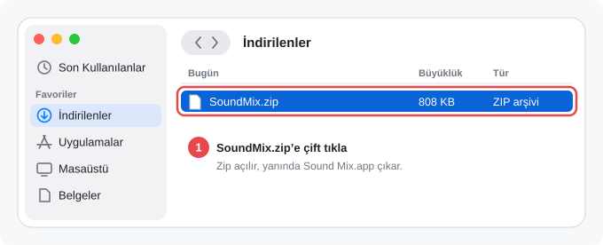
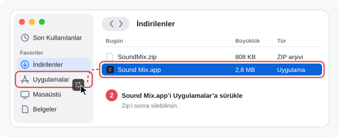
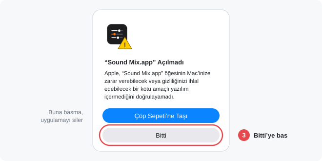
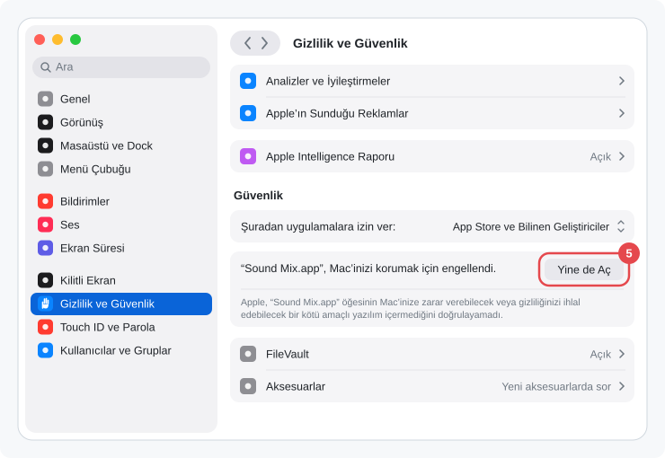

<p align="center"></p>

<h1 align="center">Sound Mix</h1>

<p align="center">Chrome'daki her videoyu ve Mac'teki her uygulamanın sesini menü çubuğundan yönet.</p>

<p align="center">Kurmak için Terminal'e yapıştır:</p>

```bash
curl -fsSL https://raw.githubusercontent.com/omerfarukgzr/sound-mix/main/install.sh | bash
```

---

macOS'un "Şu An Çalan" menüsü Chrome'da aynı anda açık olan videolardan sadece birini gösterir. Sound Mix, Chrome'daki bütün video sekmelerini menü çubuğunda ayrı ayrı listeler ve her birini tek tıkla oynatıp durdurmanı, sesini ayrı ayrı ayarlamanı sağlar.

## Özellikler

- **Chrome video listesi:** Şu an çalanlar ve son 10 dakikada durdurulanlar (süre Ayarlar'dan değişir), site ikonlarıyla birlikte. YouTube ana sayfasındaki gibi sessiz önizlemeler listeye girmez.
- **Oynat / durdur:** Videonun adına tıkla. İframe içindeki oynatıcılarla da çalışır.
- **Video başına ses:** Her videonun kendi ses çubuğu var.
- **Uygulama mikseri:** Chrome, Discord, WhatsApp gibi uygulamaların sesini ayrı ayrı kıs.
- **Mac sesi:** En üstte genel ses ve çıkış cihazı.
- **Sekmeye git:** Videonun sekmesini tek tıkla öne getir.
- **Tek tıkla güncelleme:** Yeni sürüm çıkınca menüde görünür, **Güncelle**'ye basınca kendini günceller.
- Veri toplamaz, analitik kullanmaz.

## Gereksinimler

- macOS 14.4 veya üstü (Apple Silicon ve Intel)
- Google Chrome

## Kurulum

### 1. Uygulamayı kur

#### Kolay yol: Terminal ile kurmak

**Terminal** uygulamasını aç (Spotlight'ta "Terminal" yaz), şu satırı yapıştırıp Enter'a bas:

```bash
curl -fsSL https://raw.githubusercontent.com/omerfarukgzr/sound-mix/main/install.sh | bash
```

Komut son sürümü GitHub'dan indirir, SHA-256 özetini doğrular, Uygulamalar klasörüne kurar ve açar. macOS'un "doğrulanamadı" uyarısı çıkmaz. Aynı komut eski bir kurulumu da günceller. Ne yaptığını görmek istersen: [install.sh](install.sh)

#### Terminal kullanmadan: zip ile kurmak

**1.** **[SoundMix.zip](https://github.com/omerfarukgzr/sound-mix/releases/latest/download/SoundMix.zip)** dosyasını indir ve Finder'da **İndirilenler** klasörünü aç. Orada sadece `SoundMix.zip` vardır, ona çift tıkla. Safari kullanıyorsan zip kendiliğinden açılmış olabilir, o zaman 2. adıma geç.

<p align="center"></p>

**2.** Zip açılınca yanında `Sound Mix.app` çıkar. Onu sol taraftaki **Uygulamalar**'ın üzerine sürükleyip bırak.

<p align="center"></p>

> Uygulamayı İndirilenler'den açma, mutlaka Uygulamalar'a taşı. Repo sayfasındaki yeşil **Code › Download ZIP** butonu da uygulamayı değil kaynak kodu indirir, onu kullanma.

**3.** Uygulamalar klasöründe **Sound Mix**'e çift tıkla. Uygulama Apple'a kayıtlı ücretli bir sertifikayla imzalanmadığı için macOS ilk açılışta bu uyarıyı gösterir. **Bitti**'ye bas. "Çöp Sepeti'ne Taşı"ya basma, uygulamayı siler.

<p align="center"></p>

**4.** Sol üstteki Apple menüsünden **Sistem Ayarları**'nı aç ve soldan **Gizlilik ve Güvenlik**'i seç.

<p align="center"></p>

**5.** Sağ tarafı en alta, **Güvenlik** başlığına kadar kaydır. "“Sound Mix.app”, Mac'inizi korumak için engellendi." satırının yanındaki **Yine de Aç**'a bas.

<p align="center"></p>

**6.** macOS Mac parolanı ya da Touch ID'yi ister, onayla. Bir pencere daha çıkarsa orada da **Yine de Aç**'a bas.

Bunu sadece ilk kurulumda yaparsın. Sonraki güncellemeler menüden tek tıkla olur ve bu uyarı bir daha çıkmaz.

İki yolda da kurulum bitince menü çubuğunda Sound Mix ikonu görünür.

### 2. Chrome eklentisini yükle

Uygulama ilk açılışta bir **kurulum yardımcısı** gösterir:

1. **"Eklentiler sayfasını aç"** butonuna bas. Chrome'da eklentiler sayfası açılır.
2. Chrome'da sağ üstteki **Geliştirici modu** anahtarını aç.
3. Yardımcıdaki **"Beni Chrome'a sürükle"** kutusunu Chrome'daki sayfanın üzerine sürükleyip bırak.

Eklenti bağlanınca yardımcı "Hazır!" der. Açık video sekmelerini bir kez yenile.

Yardımcıyı sonradan **Ayarlar… › Chrome eklentisi › Kur…** ile tekrar açabilirsin. Eklentide bir sorun olursa (güncel değilse ya da yanlış klasörden yükleniyorsa) menüde uyarı, aynı yerde de **Onar…** butonu çıkar. Kutuyu tekrar sürüklemen yeterli, yeni eklenti eskisinin yerine geçer. Önce kaldırman gerekmez.

> Chrome açılışta ara sıra "geliştirici modundaki eklentileri devre dışı bırak" diye hatırlatma gösterebilir. Bunu kapatman yeterli, eklenti çalışmaya devam eder.

## Güncelleme

Sound Mix günde bir kez GitHub'daki son sürüme bakar. Yeni sürüm varsa menünün en üstünde **"Yeni sürüm var"** satırı ve menü çubuğu ikonunda küçük bir nokta görünür. **Güncelle**'ye basınca yeni sürüm indirilir, SHA-256 özeti doğrulanır, eski uygulamanın yerine kurulur ve Sound Mix yeniden açılır. Ayarların korunur.

Chrome eklentisi yeni sürümde değiştiyse kendiliğinden yeniden yüklenir, tekrar kurman gerekmez. Değişmediyse eklentiye dokunulmaz, açık sekmeleri yenilemen de gerekmez.

Uygulama yerinde güncellenemezse (örneğin Downloads'tan açıldıysa ya da klasörüne yazılamıyorsa) Releases sayfası açılır. O zaman kurulum komutunu tekrar çalıştırman yeterli, eskisinin yerine son sürümü kurar.

Güncelleme kontrolünü **Ayarlar › Güncellemeleri denetle** ile kapatabilirsin. Kontrol hiçbir veri göndermez, sadece GitHub'dan son sürüm numarasını okur.

## İzinler ve gizlilik

Sound Mix **veri toplamaz.** Mikrofon, kamera, ekran kaydı veya dosyalarına erişim istemez. Kurulumda karşına çıkabilecek her şey şunlar:

| Ne | Ne zaman | Neden |
|---|---|---|
| "Tanınmayan geliştirici" uyarısı | İlk açılışta | Uygulama ücretli Apple sertifikasıyla imzalanmadı. Bir izin değil, bir kez "Yine de Aç" demen yeterli. |
| **Chrome eklentisi** izinleri | Eklenti kurulurken | Sayfalardaki video oynatıcılarını bulmak, sekme adını göstermek ve uygulamayla konuşmak için. Videolar çoğu zaman başka sitelerin içinde (iframe) oynadığı için Chrome bunu "tüm sitelerdeki verileri okuma" olarak gösterir. Eklenti sadece video ve ses öğelerine bakar. Sayfa içeriğini, şifreleri veya formları okumaz. |
| **Yalnızca Sistem Sesi Kaydı** *(isteğe bağlı)* | Bir uygulamanın sesini ilk kez %100'ün altına çektiğinde | macOS'ta bir uygulamanın sesini ayrı kısmanın tek yolu, sesini hoparlöre gitmeden önce alıp kısarak çalmak. Sadece Mac'ten çıkan sese erişir. Ses kaydedilmez, saklanmaz. Vermezsen sadece uygulama ses çubukları çalışmaz. |
| Giriş öğesi bildirimi *(isteğe bağlı)* | "Mac açılınca başlat"ı açınca | macOS'un standart bildirimi. |

Bütün izinlerin durumu ve açıklaması uygulamanın **Ayarlar › İzinler ve gizlilik** bölümünde de görünür.

> Uygulama imzasız olduğu için her yeni sürümden sonra macOS Sistem Sesi Kaydı iznini tekrar sorabilir.

## Güvenlik

- Uygulama dışarıdan bağlantı kabul etmez ve yönetici yetkisi istemez.
- Chrome köprüsü sadece Sound Mix eklentisinin kimliğiyle konuşur (`allowed_origins`).
- Uygulama ile köprü arasındaki soket ve durum dosyası sadece senin kullanıcı hesabının erişebileceği bir klasördedir (`~/Library/Caches/tab-mixer`, izin `700`, soket `600`).
- Web sayfalarından gelen veriler tür ve aralık kontrolünden geçer. Köprüye gelen mesajların boyutu sınırlıdır.
- Her sürümün `SHA-256` özeti Releases sayfasında yazar. İndirdiğin dosyayı doğrulamak için: `shasum -a 256 SoundMix.zip`
- Bir güvenlik sorunu bulursan lütfen [Issues](../../issues) üzerinden bildir.

## Nasıl çalışır

```
Chrome sekmeleri ──(eklenti)──► native messaging ──► Sound Mix.app ──► menü çubuğu
                                                         │
                         Core Audio process tap ◄────────┘  (uygulama sesleri)
```

- **Eklenti** (`Extension/`), sayfalardaki video ve ses öğelerini izler. Hangi videonun çaldığını, ne zaman durduğunu ve ses seviyesini uygulamaya bildirir.
- **Uygulama** (`Sources/TabMixer/`), Chrome tarafından köprü olarak da başlatılır. Eklentiden gelen durumu okur, menüden gelen komutları eklentiye iletir.
- **Uygulama sesleri** macOS'un Core Audio "process tap" özelliğiyle ayarlanır. Uygulamanın sesi hoparlöre gitmeden önce yakalanır ve kısılmış olarak çalınır.

Kulağına gelen ses üç ayarın çarpımıdır: **Mac sesi × uygulama sesi × video sesi.**

## Kaynaktan derleme

Xcode 16 veya üstü gerekir.

```bash
git clone https://github.com/omerfarukgzr/sound-mix.git
cd sound-mix
scripts/build.sh            # dist/app.noindex/Sound Mix.app ve dist/SoundMix.zip
scripts/build.sh --install  # ayrıca ~/Applications'a kurar ve başlatır
```

## Kaldırma

En kolayı uygulamanın içinden: **Ayarlar… › Sound Mix'i kaldır…** butonuna bas. Chrome eklentisi (Chrome ayrıca onay ister), Chrome köprüsü kaydı, Mac açılınca başlatma ve bütün ayarlar silinir, `Sound Mix.app` çöpe taşınır.

Elle kaldırmak istersen:

1. Menüden **Çık**'a bas ve `Sound Mix.app` dosyasını çöpe at.
2. Chrome'da `chrome://extensions` sayfasından eklentiyi kaldır.
3. İstersen şu dosyaları da sil:
   - `~/Library/Application Support/Sound Mix`
   - `~/Library/Caches/tab-mixer`
   - `~/Library/Application Support/Google/Chrome/NativeMessagingHosts/io.github.omerfarukgzr.tabmixer.json`

---

## English

**Sound Mix** is a macOS menu bar app that lists every playing video in Chrome (not just one, like Now Playing does), lets you play/pause each one, set per-video volume, and mix per-app volume (Chrome, Discord, …) using Core Audio process taps.

**Install:** [download SoundMix.zip](https://github.com/omerfarukgzr/sound-mix/releases/latest/download/SoundMix.zip) (always the latest release), move `Sound Mix.app` to Applications, and open it (the app is not notarized: use *System Settings › Privacy & Security › Open Anyway*). On first launch a setup assistant opens `chrome://extensions`; enable *Developer mode* and drag the extension tile from the assistant onto the page. To uninstall, use *Settings › Sound Mix'i kaldır…*.

Updates: the app checks GitHub once a day and shows a "new version" row in the menu (can be turned off in Settings); one click downloads, verifies and installs it, then relaunches. The Chrome extension is reloaded only if it changed. No data is collected. Requires macOS 14.4+ and Google Chrome. MIT licensed.
